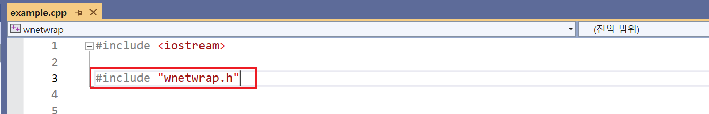

# WNetWrap

- 예제 코드 : `~/ExampleCodes/WNetWrapExample`
- 원본 코드 : https://github.com/hack-tramp/WNetWrap
	- Last Commit : 2021/07/7
	- Latest Release Version : 1.0.3

## 들어가기전에

해당 문서의 예제 코드(`~/ExampleCodes/WNetWrapExample`)에서 사용되는 라이브러리 코드는 **원본 빌드 시 발생하는 컴파일 오류 및 에러 사항을 수정한 코드**다.

### 주의 사항
- **Memory Leak 존재**
- **멀티스레드로 사용 불가능**
- Timeout 기능 사용 시 Thread 생성됨.

## 라이브러리 특징
- [WinINet](https://learn.microsoft.com/en-us/windows/win32/wininet/about-wininet) API로 개발
- `Windows`만 지원
- **`C++ 17` 이상** 필요.
- 다른 라이브러리 **종속성 없음**
- 현재 구현된 기능

## 라이브러리 설치하기

1. `~/ExampleCodes/WNetWrapExample`에서 `wnetwrap.cpp`와 `wnetwrap.h`를 자신의 프로젝트 폴더 복사한다.


2. 복사한 소스 코드를 프로젝트에 포함시킨다.


3. `C++` 버전 변경 (**C++14 이상**)


4. `SDL 검사` OFF


5. 라이브러리 헤더 파일 include



## 라이브러리 사용하기

### 예제 1. 간단한 GET 요청
```cpp
void ExampleMethodGet()
{
	wrap::Response res = wrap::HttpsRequest(
		wrap::Url{ "https://www.postman-echo.com/get" },
		wrap::Parameters{{"fruit", "mango"}, { "price","3" }}
	);

	std::cout << res.text << std::endl;
}
```

### 예제 2. 간단한 POST 요청
```cpp
void ExampleMethodPost()
{
	wrap::Response res = wrap::HttpsRequest(
		wrap::Url{ "https://www.postman-echo.com/post" },
		wrap::Method{ "POST" },
		wrap::Parameters{
			{"fruit", "mango"}, 
			{ "price","3" }
		}
	);

	std::cout << res.text << std::endl;
}
```

### 예제 3. JSON 송/수신
```cpp
// METHOD: GET
void DoJsonRequestMethodGet(const char* url, const char* body_data)
{
	wrap::Response res = wrap::HttpsRequest(
		wrap::Url{ url },
		wrap::Header{
			{"Connection", "close"}, 
			{ "Content-type", "application/json" }, 
			{ "Accept", "text/plain" }
		},
		wrap::Body{body_data}
	);

	std::cout << res.text << std::endl;
}
```

```cpp
// METHOD: POST
void DoJsonRequestMethodPost(const char* url, const char* body_data)
{
	wrap::Response res = wrap::HttpsRequest(
		wrap::Url{ url },
		wrap::Header{
			{"Connection", "close"}, 
			{ "Content-type", "application/json" }, 
			{ "Accept", "text/plain" }
		},
		wrap::Method{ "POST" },
		wrap::Body{ body_data }
	);

	std::cout << res.text << std::endl;
}
```

### 사용 예시

```cpp
int main()
{
	const char* auth_check_url = "http://127.0.0.1:11502/AuthCheck";
	const char* inapp_check_url = "http://127.0.0.1:11502/InAppCheck";

	const auto auth_check_body_data =
		R"(
			{
				"AuthID":"test01",
				"AuthToken":"DUWPQCFN5DQF4P"
			}
		)";

	const auto inapp_check_body_data =
		R"(
			{
				"Receipt":"WkuOATWDQ909OET9cBjVEXEgI3KqTTbThNFe206bywlkSBiUD1hgrCltj3g1a84d"
			}
		)";

	DoJsonRequestMethodGet(auth_check_url, auth_check_body_data);
	DoJsonRequestMethodPost(auth_check_url, auth_check_body_data);
	DoJsonRequestMethodPost(inapp_check_url, inapp_check_body_data);

	return 0;
}
```