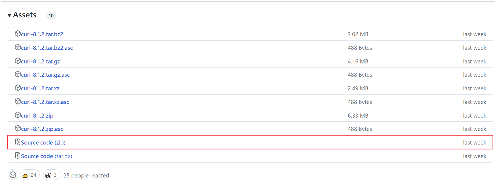
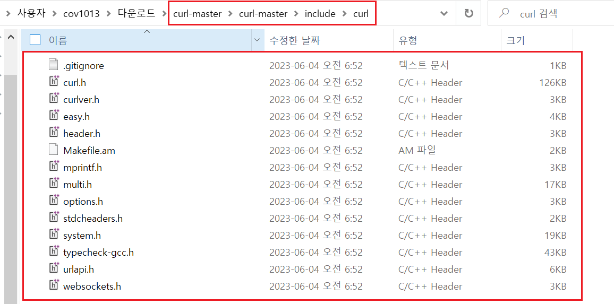
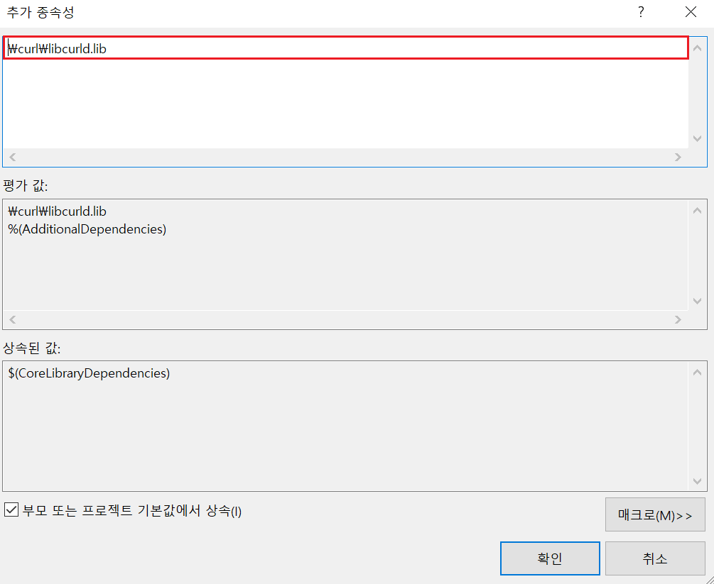
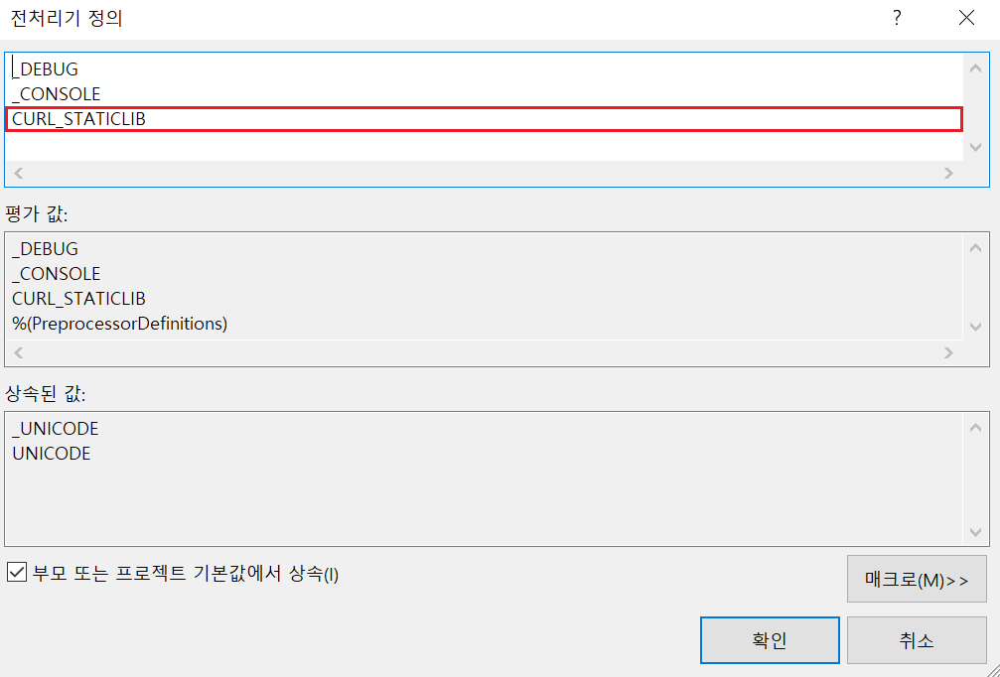
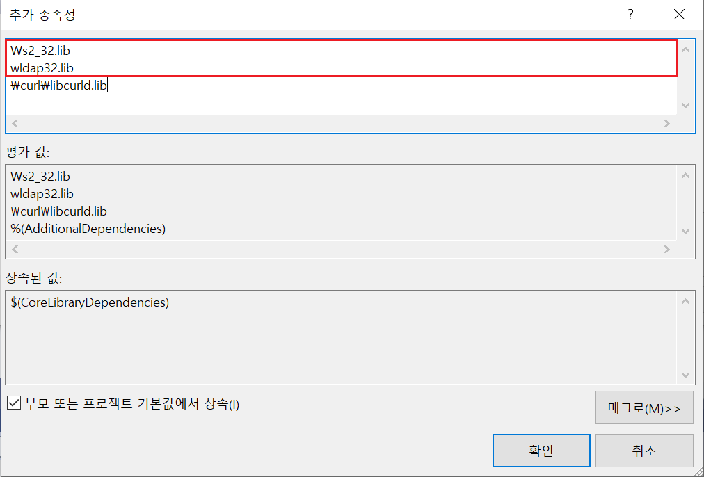

# `libcurl` 사용법

- 예제 코드 : `ExampleCodes/libcurlExample`
- 원본 코드 : https://github.com/curl/curl
	- Last Commit : 2023/06/12
	- Latest Release Version : 8.1.2

## 들어가기전에

- 해당 문서에서는 `Windows` 환경에서의 설치 방법만 설명한다.

## 라이브러리 특징

- **가장 오래되고 안정**된 데이터 전송 프로그램 (*CLI Tool*)
- 다양한 네트워크 기능 지원
- 응답 데이터는 콜백 함수로 핸들링 (*콜백 함수 미지정 시 `stdout`에 자동 출력*)
- 응답 데이터를 메모리 또는 파일로 저장할 수 있음.

## 라이브러리 설치하기

### 라이브러리 빌드하기

1. [GitHub](https://github.com/curl/curl)에서 가장 최신 버전의 **Release** 페이지로 이동


2. 소스 코드 압축 파일 다운로드



3. 압축 해제 후 폴더 내부의 `projects` 폴더로 이동


4. `generate.bat`를 실행하여 빌드에 필요한 소스 코드를 생성한다. (*소스 코드가 정상 생성됐다면 `generate.bat`이 자동 종료된다.*)


5. `projects/Windows` 폴더로 이동하여 자신의 [`Visual Studio` 버전](https://github.com/curl/curl/tree/master/projects#building-with-visual-c)에 맞는 `.sln` 파일을 오픈한다.


6. 솔루션 빌드 환경을 선택한 후 빌드한다.


### 라이브러리 적용하기

- (*참고*) 예제 파일(`ExampleCodes/libcurlExample`) 내부에 `thirdparty`라는 별도의 폴더를 생성하여 라이브러리를 관리중이다.


1. 라이브러리 헤더 파일을 내 프로젝트로 복사 (*헤더 파일을 제외한 파일은 복사할 필요 없다.*)



2. 빌드된 라이브러리를 내 프로젝트로 복사


3. 소스 파일 include


4. 라이브러리 파일 include




#### 정적 라이브러리로 적용하는 방법

프로젝트에서 정적 라이브러리로 사용하기 위해서는 몇 가지 추가 설정 해야한다.

1. 전처리기 추가



2. 종속 라이브러리 추가



## 예제 코드 

### 예제 1. 간단한 GET 요청

```cpp
const bool ExampleMethodGet()
{
	const char* url = "https://www.postman-echo.com/";

	CURL* curl = curl_easy_init();

	if (curl == NULL)
	{
		return false;
	}

	// URL
	curl_easy_setopt(curl, CURLOPT_URL, url);

	// METHOD
	// DEFAULT : GET

	// EXECUTE
	CURLcode res = curl_easy_perform(curl);

	if (res != CURLE_OK)
	{
		std::cout << "curl_easy_perform() failed: " << curl_easy_strerror(res) << std::endl;
		return false;
	}

	curl_easy_cleanup(curl);

	// callback 함수가 없으면 stdout 으로 출력된다.

	return true;
}
```

### 예제 2. 간단한 POST 요청

```cpp
const bool ExampleMethodPost()
{
	const char* url_post = "https://www.postman-echo.com/";

	CURL* curl = curl_easy_init();

	if (curl == NULL)
	{
		return false;
	}

	curl_slist* header = nullptr; 

	// URL
	curl_easy_setopt(curl, CURLOPT_URL, url_post);

	// METHOD
	curl_easy_setopt(curl, CURLOPT_POST, 1L);

	// HEADERS
	header = curl_slist_append(header, "Content-Type: application/json");
	curl_easy_setopt(curl, CURLOPT_HTTPHEADER, header);

	// SSL
	curl_easy_setopt(curl, CURLOPT_SSL_VERIFYPEER, 1L);
	curl_easy_setopt(curl, CURLOPT_SSL_VERIFYHOST, 1L);

	// DATA
	curl_easy_setopt(curl, CURLOPT_POSTFIELDS, "data");

	// EXECUTE
	CURLcode res = curl_easy_perform(curl);

	if (res != CURLE_OK)
	{
		std::cout << "curl_easy_perform() failed: " << curl_easy_strerror(res) << std::endl;
		return false;
	}

	curl_easy_cleanup(curl);

	// callback 함수가 없으면 stdout 으로 출력된다.

	return true;
}
```

### 예제 3. JSON 송/수신
```cpp
size_t OnResponse(char* ptr, size_t size, size_t nmemb, std::string* stream)
{
	int realsize = size * nmemb;

	std::cout << ptr << std::endl;

	return realsize;
}

const bool DoJsonRequest(
	const char* url, 
	const char* body_data, 
	const bool isPostMethod = false,
	const bool isSSL = false)
{
	CURL* curl = curl_easy_init();

	if(curl == NULL)
	{
		std::cout << "Failed intialize curl instance" << std::endl;
		return false;
	}

	const auto body_data_len = strlen(body_data);
	curl_slist* header = nullptr;

	// URL
	curl_easy_setopt(curl, CURLOPT_URL, url);

	// HEADER
	header = curl_slist_append(header, "Content-Type: application/json");
	curl_easy_setopt(curl, CURLOPT_HTTPHEADER, header);

	// SSL
	curl_easy_setopt(curl, CURLOPT_SSL_VERIFYPEER, isSSL);
	curl_easy_setopt(curl, CURLOPT_SSL_VERIFYHOST, isSSL);

	// METHOD
	curl_easy_setopt(curl, CURLOPT_POST, 1L);

	// BODY DATA
	curl_easy_setopt(curl, CURLOPT_POSTFIELDS, body_data);
	curl_easy_setopt(curl, CURLOPT_POSTFIELDSIZE, body_data_len);

	// CALLBACK 함수 등록
	curl_easy_setopt(curl, CURLOPT_WRITEFUNCTION, OnResponse); 

	// SEND
	CURLcode res = curl_easy_perform(curl);

	// CLEANUP
	curl_easy_cleanup(curl);
	curl_slist_free_all(header);

	if (res != CURLE_OK)
	{
		std::cout << "curl_easy_perform() failed: " << curl_easy_strerror(res) << std::endl;
		return false;
	}

	return true;
}
```

### 사용 예시
```cpp
int main()
{
	const char* auth_check_url = "http://127.0.0.1:11502/AuthCheck";
	const char* inapp_check_url = "http://127.0.0.1:11502/InAppCheck";

	const auto auth_check_body_data =
		R"(
			{
				"AuthID":"test01",
				"AuthToken":"DUWPQCFN5DQF4P"
			}
		)";

	const auto inapp_check_body_data =
		R"(
			{
				"Receipt":"WkuOATWDQ909OET9cBjVEXEgI3KqTTbThNFe206bywlkSBiUD1hgrCltj3g1a84d"
			}
		)";

	DoJsonRequest(auth_check_url, auth_check_body_data);
	DoJsonRequest(auth_check_url, auth_check_body_data, true);
	DoJsonRequest(inapp_check_url, inapp_check_body_data, true);

	return 0;
}
```