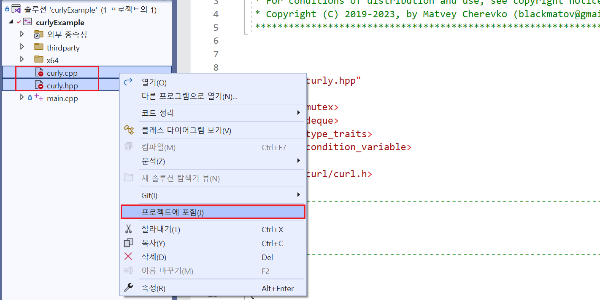
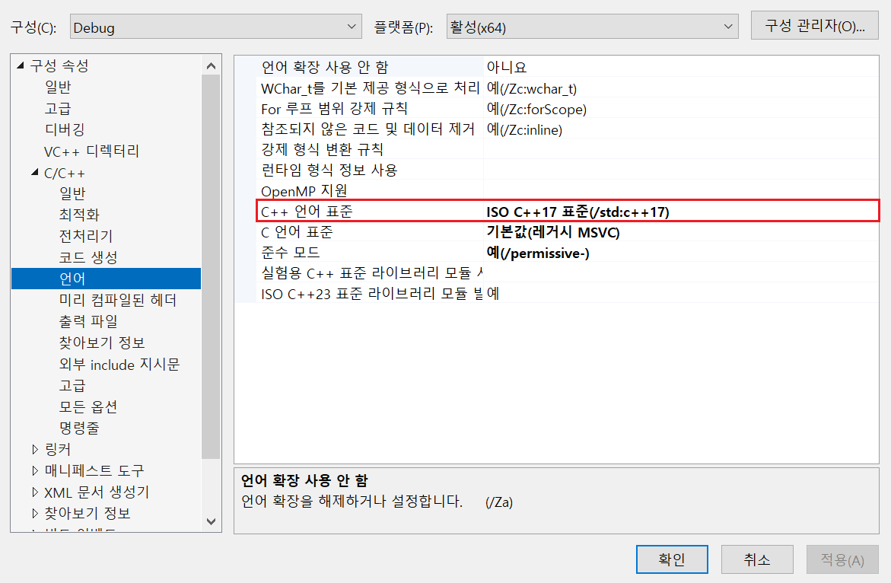
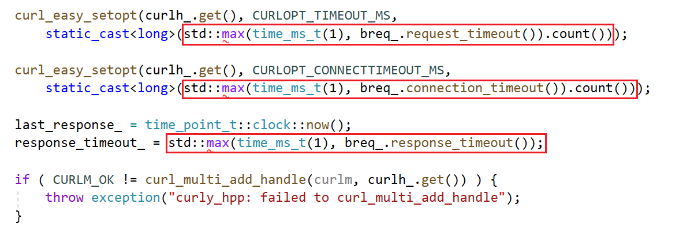
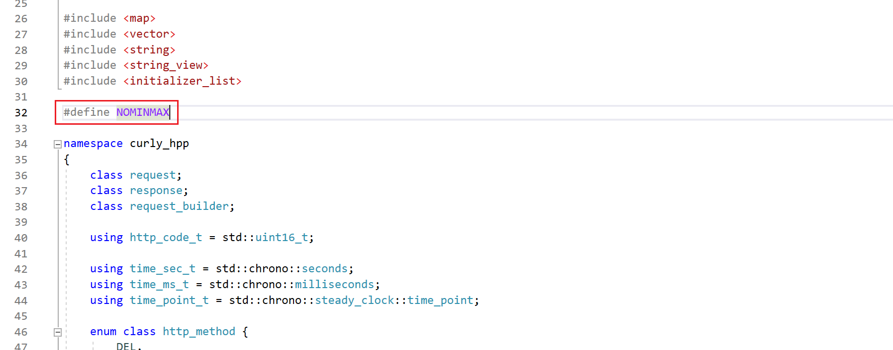

# curly.hpp

- 예제 코드 : `ExampleCodes/curlyExample`
- 원본 코드 : https://github.com/BlackMATov/curly.hpp
	- Last Commit : 2023/01/07
	- Latest Release Version : None

## 들어가기전에

- 해당 문서에서는 `Windows` 환경에서의 설치 방법만 설명한다.

- 해당 문서에서 설명할 `curly.hpp` 라이브러리는 [libcurl](https://github.com/curl/curl)을 `C++`로 랩핑한 라이브러리다. 따라서 `curly.hpp` 라이브러리를 적용하고자 하는 프로젝트에는 `libcurl` 라이브러리가 설치되어 있어야한다. ([`libcurl` 설치 방법](~/Manuals/libcurl.md))

## 라이브러리 특징

- **`C++ 17` 이상** 필요.
- 맞춤 헤더
- 비동기 요청
- 다양한 유형의 타임아웃
- URL 인코딩 쿼리 매개변수
- 완료 및 진행 콜백
- 사용자 지정 업로드 및 다운로드 스트림
- PUT, GET, HEAD, POST, PATCH, DELETE, OPTIONS 메서드

## 라이브러리 설치하기

1. [GitHub](https://github.com/BlackMATov/curly.hpp)에서 프로젝트를 다운로드한다.

2. 다운로드 한 프로젝트 폴더 내부의 다음 파일들을 자신의 프로젝트로 옮긴다.


3. 해당 파일들을 자신의 프로젝트에 포함시킨다.



4. `C++` 버전 변경



5. `curly.hpp` 파일 진입부에 `#define` 추가

`curly.cpp` 파일 내부에서 `std::max()`, `std::min()`을 사용하고 있는데 해당 함수의 이름이 `minwindef.h` 파일의 매크로와 동일해서 인식 에러가 발생한다.



따라서 `curly.hpp` 파일에 다음과 같이 `#define NOMINMAX` 추가한다.




## 예제 코드

### 필수 참고 항목

`curly` 라이브러리의 모든 요청 동작은 비동기로 진행된다. 제공되는 `curly_hpp::request_builder` 클래스의 `send()` 함수는 송신 담당 클래스인 `curl::performer` 클래스 내부 `Queue`에 Enqeue하는 함수다.

따라서 라이브러리 사용 시 실제 송신을 담당하는 `curl::performer` 클래스의 인스턴스를 정의 한 후 요청해야하며, 해당 인스턴스는 프로세스 실행 중에 유지되고 있어야한다.

```cpp
curly_hpp::performer performer;
```

### 예제 1. 간단한 요청

```cpp
void SimpleRequest()
{
	auto request = curly_hpp::request_builder()
		.method(curly_hpp::http_method::GET)
		.url("http://example.com")
		.send();

	request.wait();

	if (request.is_done())
	{
		auto response = request.take();

		std::cout << "Status code: " << response.http_code() << std::endl;
		std::cout << "Body content: " << response.content.as_string_view() << std::endl;
		std::cout << "Content Length: " << response.headers["content-length"] << std::endl << std::endl;
	}
	else
	{
		std::cout << "Error message: " << request.get_error() << std::endl;
	}
}
```

### 예제 2. JSON 송/수신
```cpp
void SendRequestJson(const char* url, const char* body, const curly_hpp::http_method method)
{
	// 헤더 세팅
	curly_hpp::header_ilist_t headers = {
		{"Content-Type", "application/json"}
	};

	// 요청 정보 세팅 후 바로 송신
	auto request = curly_hpp::request_builder()
		.method(method)
		.url(url)
		.headers(headers)
		.content(body)
		.send();

	// 응답 대기 (내부에서 상태 변수를 락걸고 변경한다.)
	request.wait();

	// 응답 처리 (내부에서 상태 변수를 락걸고 변경한다. 즉, 락을 획득했다는 건 응답 데이터를 받았다는 뜻이다.)
	if (request.is_done())
	{
		// 응답 데이터를 가져온다.
		auto response = request.take();

		std::cout << "Status code: " << response.http_code() << std::endl;
		std::cout << "Body content: " << response.content.as_string_view() << std::endl;
		std::cout << "Content Length: " << response.headers["content-length"] << std::endl << std::endl;
	}
	else
	{
		std::cout << "Error message: " << request.get_error() << std::endl;
	}
}
```

### 사용 예시
```cpp
#include <string>
#include <iostream>
#include "curl/curl.h"
#include "curly.hpp"

void Worker(const char* url, const char* body, const curly_hpp::http_method method)
{
	for (int i = 0; i < 100; i++)
	{
		examples::SendRequestJson(url, body, method);
		Sleep(1);
	}
}

int main()
{
	// 송신 담당 인스턴스 선언
	curly_hpp::performer performer;

	const char* auth_check_url = "http://127.0.0.1:11502/AuthCheck";
	const char* inapp_check_url = "http://127.0.0.1:11502/InAppCheck";
	const auto auth_check_body_data = R"(
		{
			"AuthID":"test01",
			"AuthToken":"DUWPQCFN5DQF4P"
		}
	)";

	const auto inapp_check_body_data = R"(
		{
			"Receipt":"WkuOATWDQ909OET9cBjVEXEgI3KqTTbThNFe206bywlkSBiUD1hgrCltj3g1a84d"
		}
	)";

	// 싱글 스레드로 보내기
	examples::SendRequestJson(auth_check_url, auth_check_body_data, curly_hpp::http_method::POST);
	examples::SendRequestJson(inapp_check_url, inapp_check_body_data, curly_hpp::http_method::POST);

	// 멀티 스레드로 보내기
	std::vector<std::thread> workers;
	for (int i = 0; i < 5; i++)
	{
		workers.push_back(std::thread(Worker, auth_check_url, auth_check_body_data, curly_hpp::http_method::POST));
	}

	for (int i = 0; i < 5; i++)
	{
		workers.push_back(std::thread(Worker, inapp_check_url, inapp_check_body_data, curly_hpp::http_method::POST));
	}

	for (int i = 0; i < workers.size(); i++)
	{
		workers[i].join();
	}
}
```
