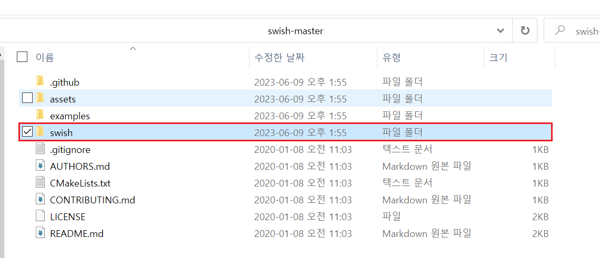
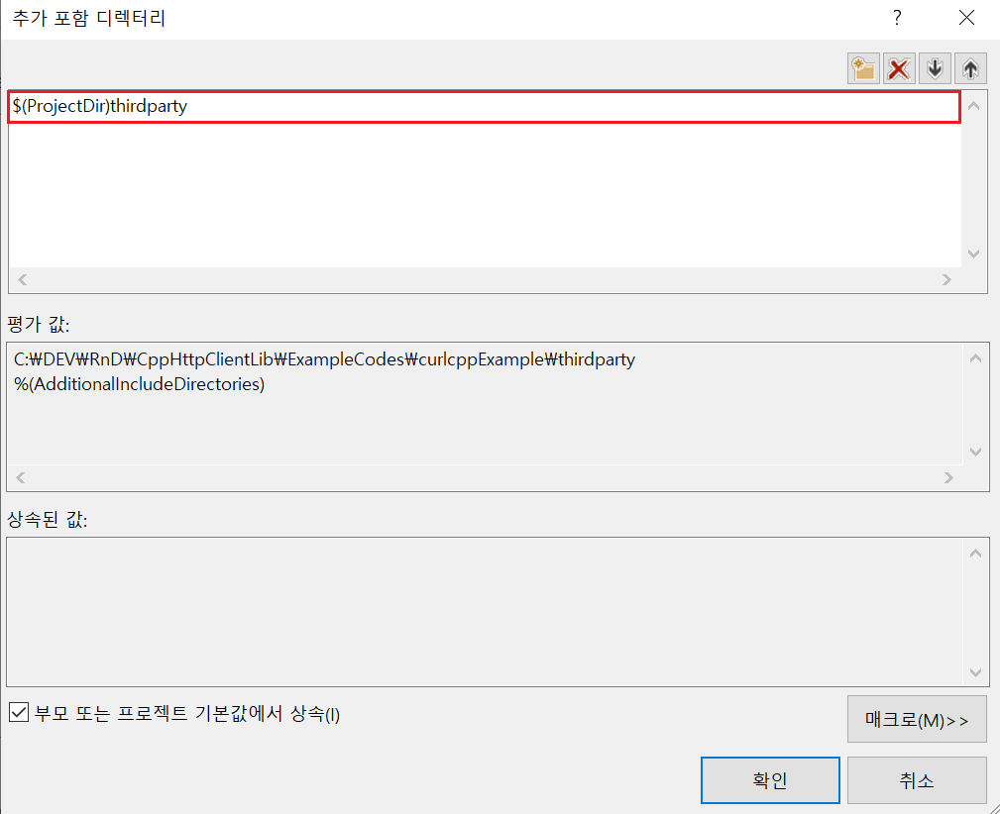
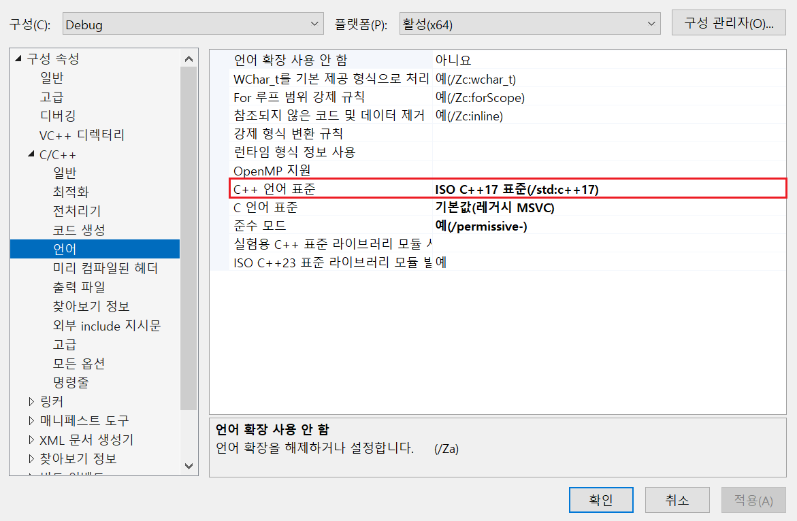
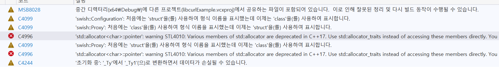
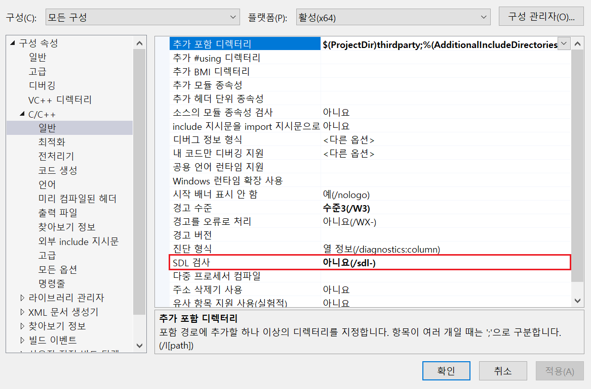

# Swish

- 예제 코드 경로 : `~/ExampleCodes/SwishExample`
- 원본 코드 : https://github.com/lamarrr/swish
	- Last Commit : 2020/01/08
	- Latest Release Version : None

## 들어가기전에

- 해당 문서에서는 `Windows` 환경에서의 설치 방법만 설명한다.

- 해당 문서에서 설명할 `Swish` 라이브러리는 [libcurl](https://github.com/curl/curl)을 `C++`로 랩핑한 라이브러리다. 따라서 `Swish` 라이브러리를 적용하고자 하는 프로젝트에는 `libcurl` 라이브러리가 설치되어 있어야한다. ([`libcurl` 설치 방법](~/Manuals/libcurl.md))

## 라이브러리 특징

- `JSON` 포맷 지원 X
- **`C++` 17 이상** 필요
- 직관적인 API

## 라이브러리 설치하기

### 참고사항
- 예제 코드에서는 프로젝트 내부에 `thirdparty`라는 별도의 폴더를 생성하여 다음과 같이 라이브러리 파일들을 관리하고 있다.


1. [GitHub](https://github.com/lamarrr/swish)에서 프로젝트를 다운로드한다.

2. 다운로드 한 프로젝트 폴더 내부에서 `swish` 폴더를 자신의 프로젝트로 옮긴다.




3. 소스코드 Include



4. `C++` 버전 변경



5. **SDL 검사** OFF

라이브러리 내부에서 더 이상 사용중이지 않는 함수를 호출하고 있다.



따라서 빌드를 하기 위해서는 **SDL 검사**를 OFF 해야한다.




## 예제 코드

### 예제 : 간단한 GET 요청
```cpp
#include <swish/swish.h>

using namespace swish;

int main() {
	auto client = Client();
	auto [response, status] = client.Get("https://github.com");
	if (IsOK(status))
	{
		std::cout << response.body.ToString() << "\n";
	}
	else
	{
		std::cerr << "The following Error occured: " << InterpretStatusCode(status) << std::endl;
	}

	return EXIT_SUCCESS;
}
```
