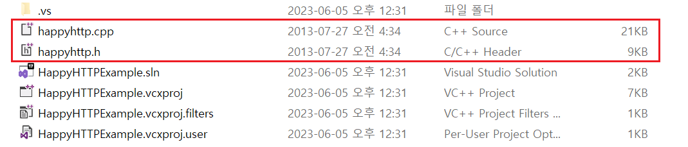
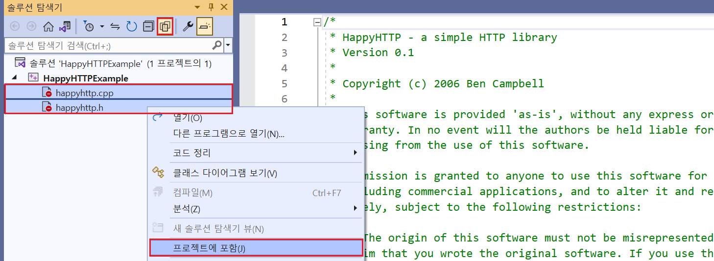

# `HappyHTTP` 사용법

예제 코드 : `~/ExampleCodes/HappyHTTPExample`

## 들어가기전에

해당 문서의 예제 코드(`~/ExampleCodes/HappyHTTPExample`)에서 사용되는 라이브러리 소스 코드는 원본 코드 빌드 시 발생하는 다양한 컴파일 오류와 에러 사항들을 수정한 코드이며, 실제 원본이 필요한 경우 [이곳](https://github.com/mingodad/HappyHTTP)을 참고한다.

## 라이브러리 설치하기

1. `~/ExampleCodes/HappyHTTPExample`에서 `happyhttp.cpp`와 `happyhttp.h`를 자신의 프로젝트 폴더 복사한다.



2. 소스 코드를 자신의 프로젝트에 포함시킨다. (*그림에서의 솔루션 이름이 `HappyHTTPExample`이지만, 실제로는 `HappyHTTP` 라이브러리를 사용하는 별도의 프로젝트라고 가정한다.*)



## 라이브러리 설명

- `Windows`와 `Linux`를 지원한다.
- 별도의 라이브러리 설치 없이, 해당 라이브러리의 소스 코드만으로 사용 가능하다.

## 예제 코드

### JSON GET 요청하기

```cpp
void SendGetRequestJson()
{
	const char* header[] = {
		"Connection", "close",
		"Content-type", "application/json",
		"Accept", "text/plain",
		0
	};

	auto body = R"(
		{
			"AuthID":"cov1013@com2us.com",
			"AuthToken":"Test"
		}
	)";

    // 서버 연결
	happyhttp::Connection conn("127.0.0.1", 11502);

	// 응답 콜백 함수 등록
	conn.setcallbacks(OnBegin, OnData, OnComplete, 0);

    // 요청 패킷 송신
	conn.request(
        "GET",                          // Method
		"/AuthCheck",                   // URI
		header, 
		(const unsigned char*)body,
		strlen(body)                    // Body Length
	);

    // 응답 대기
	while (conn.outstanding() == true)
	{
		conn.pump();
	}
}
```

### JSON POST 요청하기

```cpp
void SendPOSTRequestJson()
{
	const char* header[] = {
		"Connection", "close",
		"Content-type", "application/json",
		"Accept", "text/plain",
		0
	};

	auto body = R"(
		{
			"AuthID":"cov1013@com2us.com",
			"AuthToken":"Test"
		}
	)";

    // 서버 연결
	happyhttp::Connection conn("127.0.0.1", 11502);

	// 응답 콜백 함수 등록
	conn.setcallbacks(OnBegin, OnData, OnComplete, 0);

    // 요청 패킷 송신
	conn.request(
        "POST",                         // Method
		"/AuthCheck",                   // URI
		header, 
		(const unsigned char*)body,
		strlen(body)                    // Body Length
	);

    // 응답 대기
	while (conn.outstanding() == true)
	{
		conn.pump();
	}
}
```