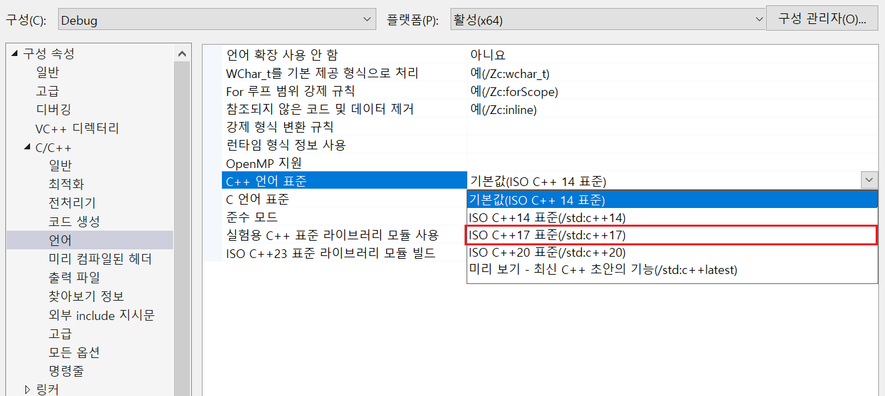

# `WNetWrap` 사용법

예제 코드 : `~/ExampleCodes/WNetWrapExample`

## 들어가기전에

해당 문서의 예제 코드(`~/ExampleCodes/WNetWrapExample`)에서 사용되는 라이브러리 소스 코드는 원본 코드 빌드 시 발생하는 다양한 컴파일 오류와 에러 사항들을 수정한 코드이며, 실제 원본이 필요한 경우 [이곳](https://github.com/hack-tramp/WNetWrap)을 참고한다.

## 라이브러리 설치하기

1. `~/ExampleCodes/WNetWrapExample`에서 `wnetwrap.cpp`와 `wnetwrap.h`를 자신의 프로젝트 폴더 복사한다.


2. 해당 소스 코드를 자신의 프로젝트에 포함시킨다. (*그림에서의 솔루션 이름이 `WNetWrapExample`이지만, 실제로는 `WNetWrap` 라이브러리를 사용하는 별도의 프로젝트라고 가정한다.*)


3. 자신의 프로젝트에서 `C++` 버전을 변경한다. (**최소 C++17 이상**의 버전이 필요하다.)



4. 자신의 프로젝트에서 `SDL 검사`를 OFF한다.


5. 자신의 프로젝트에서 라이브러리를 `#include`한다.


## 라이브러리 사용하기

### 예제 1. METHOD : GET
```cpp
void ExampleMethodGet()
{
	wrap::Response res = wrap::HttpsRequest(
		wrap::Url{ "https://www.postman-echo.com/get" },
		wrap::Parameters{{"fruit", "mango"}, { "price","3" }}
	);

	std::cout << res.text << std::endl;
}
```

### 예제 2. METHOD : POST
```cpp
void ExampleMethodPost()
{
	wrap::Response res = wrap::HttpsRequest(
		wrap::Url{ "https://www.postman-echo.com/post" },
		wrap::Method{ "POST" },
		wrap::Parameters{
			{"fruit", "mango"}, 
			{ "price","3" }
		}
	);

	std::cout << res.text << std::endl;
}
```

### 예제 3. JSON Request
```cpp
// METHOD: GET
void DoJsonRequestMethodGet(const char* url, const char* body_data)
{
	wrap::Response res = wrap::HttpsRequest(
		wrap::Url{ url },
		wrap::Header{
			{"Connection", "close"}, 
			{ "Content-type", "application/json" }, 
			{ "Accept", "text/plain" }
		},
		wrap::Body{body_data}
	);

	std::cout << res.text << std::endl;
}
```

```cpp
// METHOD: POST
void DoJsonRequestMethodPost(const char* url, const char* body_data)
{
	wrap::Response res = wrap::HttpsRequest(
		wrap::Url{ url },
		wrap::Header{
			{"Connection", "close"}, 
			{ "Content-type", "application/json" }, 
			{ "Accept", "text/plain" }
		},
		wrap::Method{ "POST" },
		wrap::Body{ body_data }
	);

	std::cout << res.text << std::endl;
}
```

#### 실제 사용 예시

```cpp
int main()
{
	const char* auth_check_url = "http://127.0.0.1:11502/AuthCheck";
	const char* inapp_check_url = "http://127.0.0.1:11502/InAppCheck";

	const auto auth_check_body_data =
		R"(
			{
				"AuthID":"test01",
				"AuthToken":"DUWPQCFN5DQF4P"
			}
		)";

	const auto inapp_check_body_data =
		R"(
			{
				"Receipt":"WkuOATWDQ909OET9cBjVEXEgI3KqTTbThNFe206bywlkSBiUD1hgrCltj3g1a84d"
			}
		)";

	DoJsonRequestMethodGet(auth_check_url, auth_check_body_data);
	DoJsonRequestMethodPost(auth_check_url, auth_check_body_data);
	DoJsonRequestMethodPost(inapp_check_url, inapp_check_body_data);

	return 0;
}
```