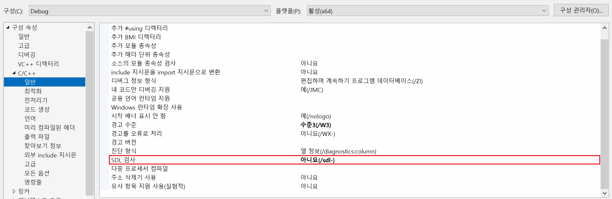

# `WNetWrap` 사용법

예제 코드 : `~/ExampleCodes/WNetWrapExample`

## 들어가기전에

해당 문서의 예제 코드(`~/ExampleCodes/WNetWrapExample`)에서 사용되는 라이브러리 소스 코드는 원본 코드 빌드 시 발생하는 다양한 컴파일 오류와 에러 사항들을 수정한 코드이며, 실제 원본이 필요한 경우 [이곳](https://github.com/hack-tramp/WNetWrap)을 참고한다.

## 라이브러리 설치하기

1. `~/ExampleCodes/WNetWrapExample`에서 `wnetwrap.cpp`와 `wnetwrap.h`를 자신의 프로젝트 폴더 복사한다.


2. 해당 소스 코드를 자신의 프로젝트에 포함시킨다. (*그림에서의 솔루션 이름이 `WNetWrapExample`이지만, 실제로는 `WNetWrap` 라이브러리를 사용하는 별도의 프로젝트라고 가정한다.*)


3. 자신의 프로젝트에서 `C++` 버전을 변경한다. (**최소 C++17 이상**의 버전이 필요하다.)


4. 자신의 프로젝트에서 `SDL 검사`를 OFF한다.



5. 자신의 프로젝트에서 라이브러리를 `#include`한다.


<br>

## 라이브러리 설명

- `Win32API`의 `wininet.h`를 사용한 라이브러리다.
- 별도의 라이브러리 설치 없이, 해당 라이브러리의 소스 코드만으로 사용 가능하다.

### 라이브러리 사용 시 참고사항

- **Timeout 기능을 사용하면 라이브러리 내부에서 별도의 스레드가 생성된다.**

<br>

## 예제코드

### Get Request
```cpp
void SendRequestMethodGet()
{
	wrap::Response res = wrap::HttpsRequest(
		wrap::Url{ "https://www.postman-echo.com/get" },
		wrap::Parameters{{"fruit", "mango"}, { "price","30" }}
	);

	std::cout << res.text << std::endl;
}
```

### POST Request
```cpp
void SendRequestMethodPost()
{
	wrap::Response res = wrap::HttpsRequest(
		wrap::Url{ "https://www.postman-echo.com/post" },
		wrap::Method{ "POST" },
		wrap::Parameters{{"fruit", "mango"}, { "price","30" }}
	);

	std::cout << res.text << std::endl;
}
```

### GET Request (JSON)
```cpp
void SendJsonRequestMethodGet(const std::string& URL, const std::string& body)
{
	wrap::Response res = wrap::HttpsRequest(
		wrap::Url{ URL },
		wrap::Header{{"Connection", "close"}, { "Content-type", "application/json" }, { "Accept", "text/plain" }},
		wrap::Body{body}
	);

	std::cout << res.text << std::endl;
}
```

### POST Request (JSON)
```cpp
void SendJsonRequestMethodPost(const std::string& URL, const std::string& body)
{
	wrap::Response res = wrap::HttpsRequest(
		wrap::Url{ URL },
		wrap::Header{{"Connection", "close"}, { "Content-type", "application/json" }, { "Accept", "text/plain" }},
		wrap::Method{ "POST" },
		wrap::Body{body}
	);

	std::cout << res.text << std::endl;
}
```

### 사용하는 부분
```cpp
{
	// Postman Echo Test
	SendRequestMethodGet();
	SendRequestMethodPost();


	// FakerHiveServer AuthCheck Test
	const std::string AUTH_CHECK_SERVER_URL = "http://127.0.0.1:11502/AuthCheck";
	std::string authCheckReqData = R"(
		{
			"AuthID":"cov1013@com2us.com",
			"AuthToken":"Test"
		}
	)";
	SendJsonRequestMethodGet(AUTH_CHECK_SERVER_URL, authCheckReqData);
	SendJsonRequestMethodPost(AUTH_CHECK_SERVER_URL, authCheckReqData);


	// FakerHiveServer InAppCheck Test
	const std::string INAPP_CHECK_SERVER_URL = "http://127.0.0.1:11502/InAppCheck";
	std::string inAppCheckReqData = R"(
		{
			"Receipt":"WkuOATWDQ909OET9cBjVEXEgI3KqTTbThNFe206bywlkSBiUD1hgrCltj3g1a84d"
		}
	)";
	SendJsonRequestMethodPost(INAPP_CHECK_SERVER_URL, inAppCheckReqData);
}
```