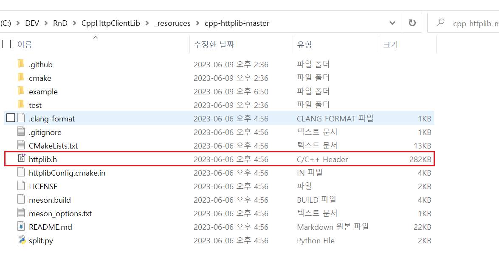
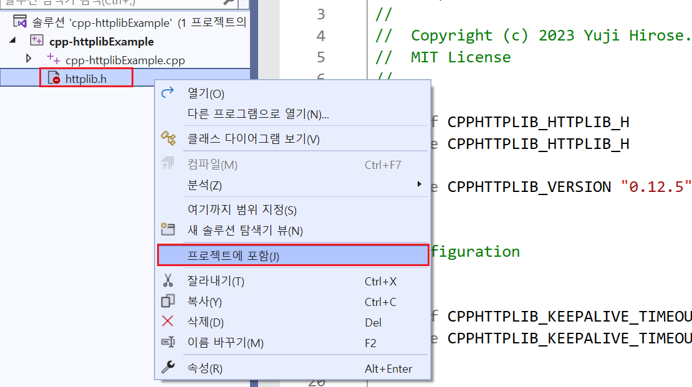

# `cpp-httplib` 사용법

- 예제 코드 경로 : `ExampleCodes/cpp-httplibExample`

## 들어가기전에

- 해당 문서에서는 `Windows` 환경에서의 설치 방법만 설명한다.

## 라이브러리 설치하기

1. [GitHub](https://github.com/yhirose/cpp-httplib)에서 프로젝트를 다운로드한다.

2. 다운로드 한 프로젝트 폴더 내부의 `httplib.h`파일을 자신의 프로젝트로 옮긴다.



3. 해당 파일을 자신의 프로젝트에 포함시킨다.



## 라이브러리 사용하기

```cpp
#include <iostream>
#include "httplib.h"

int main() 
{
	httplib::Headers headers = { 
		{"Content-Type", "application/json"} 
	};

	std::string body = R"(
		{
			"AuthID":"test01",
			"AuthToken":"DUWPQCFN5DQF4P"
		}
	)";

	httplib::Client cli("127.0.0.1", 11502);
	if (auto res = cli.Post("/AuthCheck", headers, body, "application/json"))
	{
		std::cout << res->status << std::endl;
		std::cout << res->body << std::endl;
	}
	else 
	{
		std::cout << "error code: " << res.error() << std::endl;
	}

	return 0;
}
```