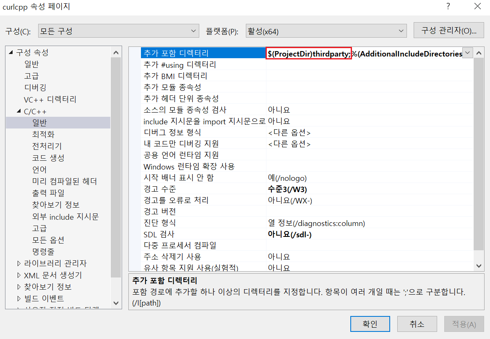
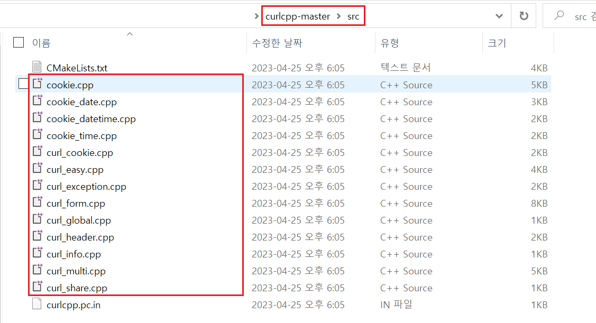
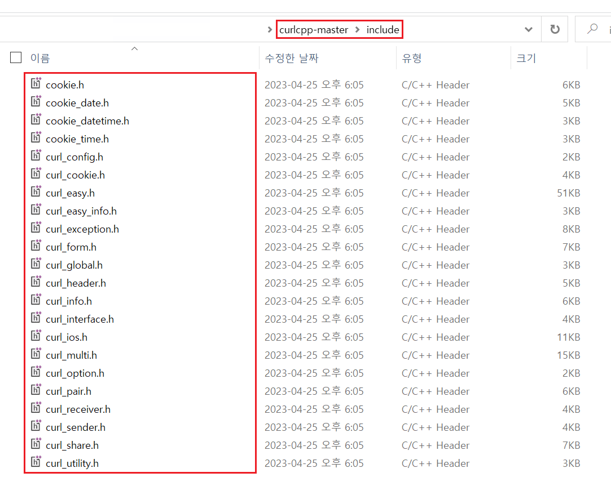
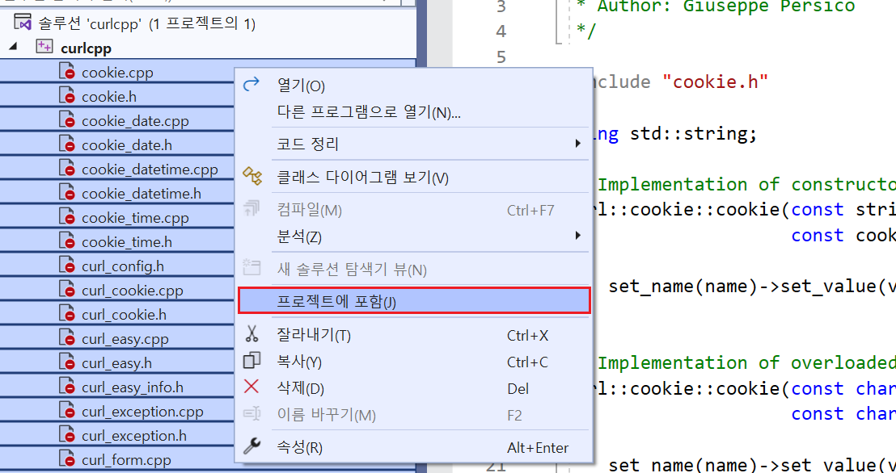
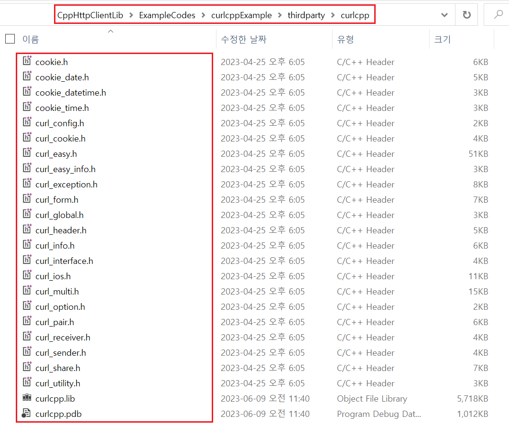

# `curlcpp` 사용법

예제 코드 : `~/ExampleCodes/curlcppExample`

## 들어가기전에

해당 문서에서 설명할 `curlcpp` 라이브러리는 [libcurl]()을 `C++`로 랩핑한 라이브러리다.

따라서 해당 라이브러리를 사용하기 위해서는 프로젝트에 `libcurl` 라이브러리가 설치되어 있어야한다. 

(*`libcurl` 라이브러리 설치 방법은 다음 [문서](~/Manuals/libcurl.md)를 참고한다.*)

## 라이브러리 설치하기

`curlcpp` 라이브러리는 기본적으로 `CMake` 파일이 제공된다. 

하지만 Windows에서 `CMake`를 사용할 경우 구성 파일을 생성하는도중 `curl`에 대한 경로를 찾을 수 없다는 에러가 발생한다.

따라서 해당 문서에서는 `Visual Stduio`를 사용하여 직접 라이브러리 소스 코드를 빌드한다.

1. 먼저 `curlcpp` 라이브러리의 소스 코드를 빌드하기 위한 새로운 프로젝트를 생성한다. (*여기서는 빈 프로젝트로 생성했다.*)

2. 생성한 프로젝트로 다음 [문서](~/Manuals/libcurl.md)를 참고하여 `libcurl` 라이브러리의 **헤더 파일만 복사**한다. (*해당 문서에서는 `~/thirdparty/curl` 폴더를 생성하여 이곳에 해더 파일을 복사했다.*)

3. `curlcpp` 라이브러리 내부에서 안전하지 않는 함수 (*ex:`strcpy()`*)를 사용하고 있기 때문에 **SDL 검사**를 **OFF**한다.(*실제 사용 시에는 해당 함수들을 안전한 함수로 변경하는 것을 추천한다.*)

- (*선택사항*) 2.번 과정에서 복사한 `libcurl` 라이브러리의 헤더 파일이 존재하는 경로를 **추가 포함 디렉터리**에 추가한다.

4. [GitHub](https://github.com/JosephP91/curlcpp)에서 `curlcpp` 라이브러리 프로젝트를 다운받아, 다운 받은 폴더 안의 `~/src/*.cpp` 파일들과 `~/include/*.hpp` 파일들을 프로젝트에 복사 후 포함시킨다.

5. 이후 원하는 라이브러리 형태로 빌드한다.

6. 빌드된 라이브러리 파일(`.lib`, `.dll`)과 `curlcpp` 헤더 파일들을 `curlcpp` 라이브러리를 사용할 자신의 프로젝트로 복사한 후  프로젝트에서 `import`하여 사용한다.

## 라이브러리 설명

- [공식사이트](https://josephp91.github.io/curlcpp)
- `libcurl` 필요
- `libcurl`의 **C++ 버전**

## 라이브러리 사용하기
