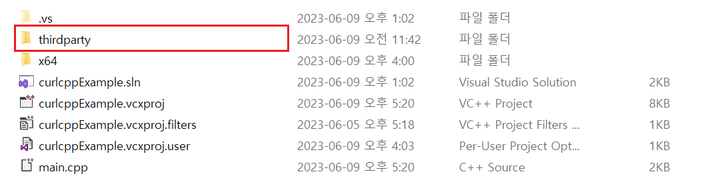

# `curlcpp` 사용법

- 예제 코드 경로 : `ExampleCodes/curlcppExample`

## 들어가기전에

- 해당 문서에서는 `Windows` 환경에서의 설치 방법만 설명한다.

- 해당 문서에서 설명할 `curlcpp` 라이브러리는 [libcurl](https://github.com/curl/curl)을 `C++`로 랩핑한 라이브러리다. 따라서 `curlcpp` 라이브러리를 적용하고자 하는 프로젝트에는 `libcurl` 라이브러리가 설치되어 있어야한다. ([`libcurl` 설치 방법](~/Manuals/libcurl.md))

## 라이브러리 설치하기

`curlcpp` 라이브러리는 기본적으로 `CMake` 파일이 제공된다. 하지만 Windows에서 `CMake`를 사용하여 `curlcpp` 솔루션 파일을 생성하는 경우 구성 파일을 생성하는 과정에서 `curl` 경로를 찾을 수 없다는 에러가 발생한다.

따라서 해당 문서에서는 `Visual Stduio`를 사용하여 직접 `curlcpp` 라이브러리를 빌드한다.

### 라이브러리 빌드하기

1. 라이브러리 빌드용 프로젝트 생성


2. 빌드용 프로젝트에 `libcurl` 라이브러리 **헤더 파일 복사** (*예제에서는 `/thirdparty/curl` 폴더를 생성하여 이곳에 복사했다.*)


3. **SDL 검사** OFF 

- `curlcpp` 라이브러리 내부에서 안전하지 않은 함수 (*`strcpy()`*)가 사용되고 있다.
- 따라서 **SDL 검사**를 사용하는 상태에서 빌드할 경우 에러가 발생한다.
- 실제 사용시에는 안전하지 않은 함수를 안전한 함수로 변경하여 사용할 것을 추천한다.


4. `libcurl` 헤더 파일 폴더를 **추가 포함 디렉터리**에 추가(*선택사항*)


5. [GitHub](https://github.com/JosephP91/curlcpp)에서 `curlcpp` 라이브러리 프로젝트 다운로드

6. 다운받은 프로젝트 폴더 내부의 다음 파일들을 빌드용 프로젝트에 포함


7. 빌드.


### 내 프로젝트로 라이브러리 Import하기

- (*참고사항*) 예제에서는 프로젝트 내부에 `thirdparty`라는 별도의 폴더를 생성하여 다음과 같이 라이브러리 파일들을 관리하고 있다.




1. 라이브러리 헤더 파일을 내 프로젝트(**빌드용 프로젝트가 아니다**)로 복사


2. 빌드된 라이브러리를 내 프로젝트(**빌드용 프로젝트가 아니다**)로 복사


3. 소스 파일 include


4. 라이브러리 파일 include


## 라이브러리 사용하기

### JSON Request
```cpp
const bool DoJsonRequest(
	const char* url, 
	const char* body_data, 
	const bool isPostMethod = false,
	const bool isSSL = false)
{
	curl::curl_easy easy;
	curl_slist* header = nullptr;
	header = curl_slist_append(header, "Content-Type: application/json");

	const auto body_data_len = strlen(body_data);

	easy.add<CURLOPT_URL>(url);
	easy.add<CURLOPT_POST>(isPostMethod);
	easy.add<CURLOPT_HTTPHEADER>(header);
	easy.add<CURLOPT_SSL_VERIFYPEER>(isSSL);
	easy.add<CURLOPT_SSL_VERIFYHOST>(isSSL);
	easy.add<CURLOPT_POSTFIELDS>(body_data);
	easy.add<CURLOPT_POSTFIELDSIZE>(body_data_len);

	try {
		easy.perform();
	}
	catch (curl::curl_easy_exception& error) {
		std::cerr << error.what() << std::endl;
		return false;
	}

	return true;
}
```

#### 실제 사용 예시
```cpp
#include <string>
#include <iostream>
#include <cstring>

#include "curl/curl.h"
#include "curlcpp/curl_easy.h"

int main()
{
	const char* auth_check_url = "http://127.0.0.1:11502/AuthCheck";
	const char* inapp_check_url = "http://127.0.0.1:11502/InAppCheck";

	const auto auth_check_body_data =
		R"(
			{
				"AuthID":"test01",
				"AuthToken":"DUWPQCFN5DQF4P"
			}
		)";

	const auto inapp_check_body_data =
		R"(
			{
				"Receipt":"WkuOATWDQ909OET9cBjVEXEgI3KqTTbThNFe206bywlkSBiUD1hgrCltj3g1a84d"
			}
		)";

	DoJsonRequest(auth_check_url, auth_check_body_data);
	DoJsonRequest(auth_check_url, auth_check_body_data, true);
	DoJsonRequest(inapp_check_url, inapp_check_body_data, true);

	return 0;
}
```