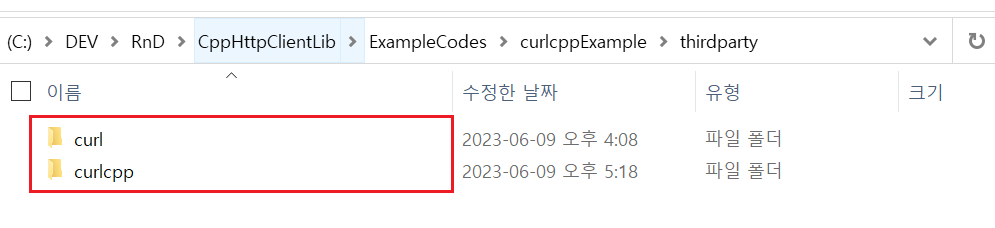
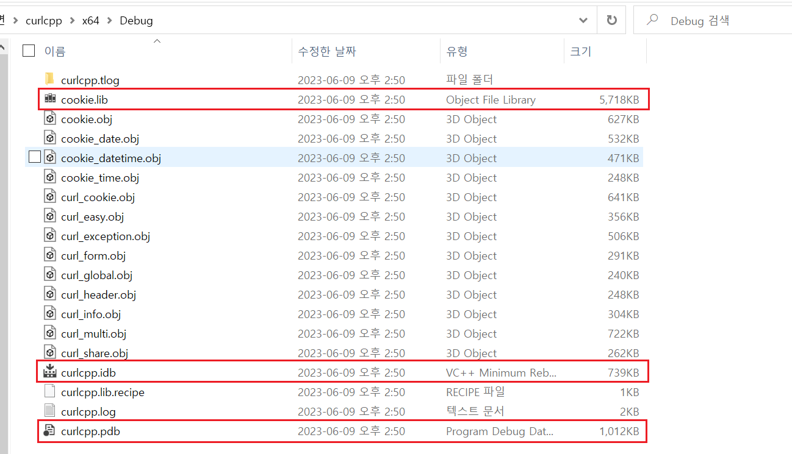

# `curlcpp` 사용법

- 예제 코드 경로 : `ExampleCodes/curlcppExample`

## 들어가기전에

- 해당 문서에서는 `Windows` 환경에서의 설치 방법만 설명한다.

- 해당 문서에서 설명할 `curlcpp` 라이브러리는 [libcurl](https://github.com/curl/curl)을 `C++`로 랩핑한 라이브러리다. 따라서 `curlcpp` 라이브러리를 적용하고자 하는 프로젝트에는 `libcurl` 라이브러리가 설치되어 있어야한다. ([`libcurl` 설치 방법](~/Manuals/libcurl.md))

## 라이브러리 설치하기

`curlcpp` 라이브러리는 기본적으로 `CMake` 파일이 제공된다. 하지만 Windows에서 `CMake`를 사용하여 `curlcpp` 솔루션 파일을 생성하는 경우 구성 파일을 생성하는 과정에서 `curl` 경로를 찾을 수 없다는 에러가 발생한다.

따라서 해당 문서에서는 `Visual Stduio`를 사용하여 직접 `curlcpp` 라이브러리를 빌드한다.

### 라이브러리 빌드하기

1. 라이브러리 빌드용 프로젝트 생성


2. 빌드용 프로젝트에 `libcurl` 라이브러리 **헤더 파일 복사** (*예제에서는 `/thirdparty/curl` 폴더를 생성하여 이곳에 복사했다.*)


3. **SDL 검사** OFF 

- `curlcpp` 라이브러리 내부에서 안전하지 않은 함수 (*`strcpy()`*)가 사용되고 있다.
- 따라서 **SDL 검사**를 사용하는 상태에서 빌드할 경우 에러가 발생한다.
- 실제 사용시에는 안전하지 않은 함수를 안전한 함수로 변경하여 사용할 것을 추천한다.


4. `libcurl` 헤더 파일 폴더를 **추가 포함 디렉터리**에 추가(*선택사항*)


5. [GitHub](https://github.com/JosephP91/curlcpp)에서 `curlcpp` 라이브러리 프로젝트 다운로드

6. 다운받은 프로젝트 폴더 내부의 다음 파일들을 빌드용 프로젝트에 포함


7. 빌드.


### 라이브러리 적용하기

- (*참고사항*) 예제에서는 프로젝트 내부에 `thirdparty`라는 별도의 폴더를 생성하여 다음과 같이 라이브러리 파일들을 관리하고 있다.




1. 라이브러리 헤더 파일을 내 프로젝트(**빌드용 프로젝트가 아니다**)로 복사


2. 빌드된 라이브러리를 내 프로젝트(**빌드용 프로젝트가 아니다**)로 복사



3. 소스 파일 include


4. 라이브러리 파일 include


## 예제코드

### 예제1. 간단한 요청
```cpp
void SimpleRequest()
{
	curl::curl_easy handle;

	handle.add<CURLOPT_URL>("http://example.com/");
	handle.add<CURLOPT_FOLLOWLOCATION>(1L);

	try 
	{
		handle.perform();
	}
	catch (curl::curl_easy_exception& error) 
	{
		std::cerr << error.what() << std::endl;
	}
}
```

### 예제2. 세션 정보 얻기
```cpp
void GetSessionInfos()
{
	std::ostringstream stream;
	curl::curl_ios<std::ostringstream> ios(stream);
	curl::curl_easy handle(ios);

	handle.add<CURLOPT_URL>("http://example.com/");
	handle.add<CURLOPT_FOLLOWLOCATION>(1L);

	try 
	{
		handle.perform();

		// 출력하고자하는 정보 얻기
		auto x = handle.get_info<CURLINFO_CONTENT_TYPE>();

		// 정보 출력
		std::cout << x.get() << std::endl;

	}
	catch (curl::curl_easy_exception& error) 
	{
		std::cerr << error.what() << std::endl;
		error.print_traceback();
	}
}
```

### 예제3. 응답데이터 파일에 저장하기
```cpp
void StoreResponseDataFromFile(const std::string& path)
{
	std::ofstream file;	// 응답데이터 저장할 파일 핸들러
	file.open(path);

	curl::curl_ios<std::ostream> writer(file);
	curl::curl_easy handle(writer);

	handle.add<CURLOPT_URL>("http://example.com/");
	handle.add<CURLOPT_FOLLOWLOCATION>(1L);

	try 
	{
		handle.perform();
	}
	catch (curl::curl_easy_exception& error) 
	{
		std::cerr << error.what() << std::endl;
		error.print_traceback();
	}

	file.close();
}
```

### 예제4. 응답데이터 변수에 저장하기
```cpp
void StoreResponseDataFromMemory()
{
	std::ostringstream mem;	// 응답 데이터 저장할 메모리

	curl::curl_ios<std::ostream> writer(mem);
	curl::curl_easy handle(writer);

	handle.add<CURLOPT_URL>("http://example.com/");
	handle.add<CURLOPT_FOLLOWLOCATION>(1L);

	try
	{
		handle.perform();

		std::cout << mem.str() << std::endl;
	}
	catch (curl::curl_easy_exception& error)
	{
		std::cerr << error.what() << std::endl;
		error.print_traceback();
	}
}
```

### 예제5. Sender / Receiver 사용하기
```cpp
void UsedReceiverSender()
{
	std::string request = "GET / HTTP/1.0\r\nHost: example.com\r\n\r\n";
	curl::curl_easy handle;

	// 연결만하기
	try 
	{
		handle.add<CURLOPT_URL>("http://example.com/");
		handle.add<CURLOPT_CONNECT_ONLY>(true);
		handle.perform();
	}
	catch (curl::curl_easy_exception& error) 
	{
		curl::curlcpp_traceback errors = error.get_traceback();
		error.print_traceback();
	}

	// 요청 송신하기
	curl::curl_sender<std::string> sender(handle);
	sender.send(request);

	std::cout << "Sent bytes: " << sender.get_sent_bytes() << std::endl;

	// 응답 수신하기
	for (;;)
	{
		try 
		{
			curl::curl_receiver<char, 1024> receiver;
			receiver.receive(handle);

			const auto received_bytes = receiver.get_received_bytes();
			if (received_bytes == 0)
			{
				break;
			}

			std::cout << "Receiver bytes: " << received_bytes << std::endl;

		}
		catch (curl::curl_easy_exception& error) 
		{
			break;
		}
	}
}
```

### 예제6. JSON 송신하기
```cpp
const bool SendRequestJson(const char* url, const char* body)
{
	curl::curl_easy handle;
	curl_slist* header = nullptr;
	header = curl_slist_append(header, "Content-Type: application/json");

	const auto doby_len = strlen(body);

	handle.add<CURLOPT_URL>(url);
	handle.add<CURLOPT_POST>(1L);
	handle.add<CURLOPT_HTTPHEADER>(header);	// 헤더 세팅
	handle.add<CURLOPT_POSTFIELDS>(body);
	handle.add<CURLOPT_POSTFIELDSIZE>(doby_len);

	try 
	{
		handle.perform();
	}
	catch (curl::curl_easy_exception& error) 
	{
		std::cerr << error.what() << std::endl;
		return false;
	}

	return true;
}
```

### 예제 테스트 코드
```cpp
int main()
{
	const char* auth_check_url = "http://127.0.0.1:11502/AuthCheck";
	const char* inapp_check_url = "http://127.0.0.1:11502/InAppCheck";
	const auto auth_check_body_data = R"(
		{
			"AuthID":"test01",
			"AuthToken":"DUWPQCFN5DQF4P"
		}
	)";
	const auto inapp_check_body_data = R"(
		{
			"Receipt":"WkuOATWDQ909OET9cBjVEXEgI3KqTTbThNFe206bywlkSBiUD1hgrCltj3g1a84d"
		}
	)";

	examples::SimpleRequest();
	examples::StoreResponseDataFromFile("./output.txt");
	examples::StoreResponseDataFromMemory();
	examples::GetSessionInfos();
	examples::UsedReceiverSender();
	examples::SendRequestJson(auth_check_url, auth_check_body_data);
	examples::SendRequestJson(inapp_check_url, inapp_check_body_data);

	return 0;
}
```