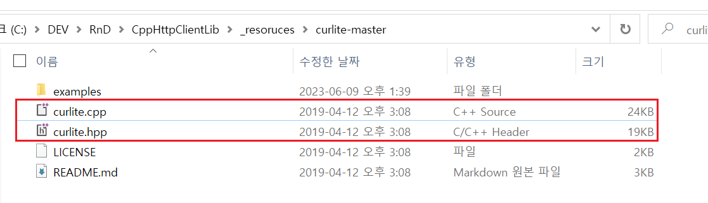
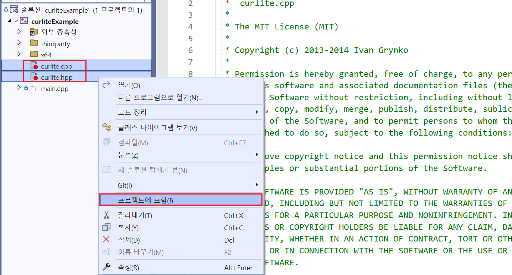

# `curlite.hpp` 사용법

- 예제 코드 경로 : `/ExampleCodes/curliteExample`

## 들어가기전에

- 해당 문서에서는 `Windows` 환경에서의 설치 방법만 설명한다.

- 해당 문서에서 설명할 `curcurlite` 라이브러리는 [libcurl](https://github.com/curl/curl)을 `C++`로 랩핑한 라이브러리다. 따라서 `curlite` 라이브러리를 적용하고자 하는 프로젝트에는 `libcurl` 라이브러리가 설치되어 있어야한다. ([`libcurl` 설치 방법](~/Manuals/libcurl.md))

## 라이브러리 설치하기

1. [GitHub]()에서 프로젝트를 다운로드한다.

2. 다운로드 한 프로젝트 폴더 내부의 다음 파일들을 자신의 프로젝트로 옮긴다.

3. 해당 파일들을 자신의 프로젝트에 포함시킨다.

## 라이브러리 설명

## 라이브러리 사용하기
