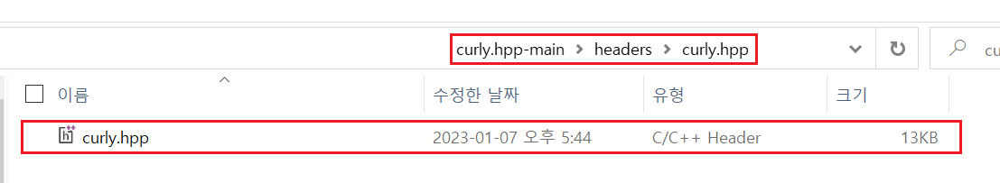
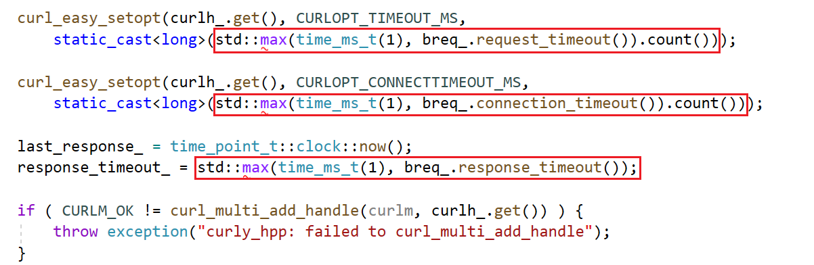
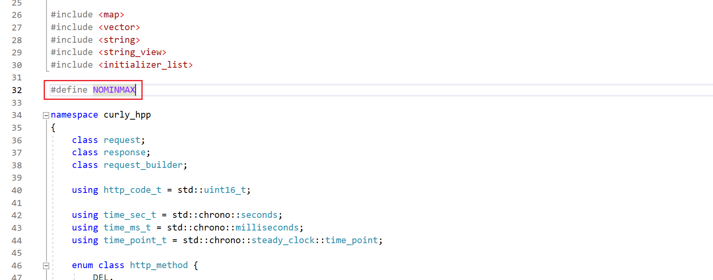

# `curly.hpp` 사용법

- 예제 코드 경로 : `ExampleCodes/curlyExample`

## 들어가기전에

- 해당 문서에서는 `Windows` 환경에서의 설치 방법만 설명한다.

- 해당 문서에서 설명할 `curly.hpp` 라이브러리는 [libcurl](https://github.com/curl/curl)을 `C++`로 랩핑한 라이브러리다. 따라서 `curly.hpp` 라이브러리를 적용하고자 하는 프로젝트에는 `libcurl` 라이브러리가 설치되어 있어야한다. ([`libcurl` 설치 방법](~/Manuals/libcurl.md))

## 라이브러리 설치하기

1. [GitHub](https://github.com/BlackMATov/curly.hpp)에서 프로젝트를 다운로드한다.

2. 다운로드 한 프로젝트 폴더 내부의 다음 파일들을 자신의 프로젝트로 옮긴다.




3. 해당 파일들을 자신의 프로젝트에 포함시킨다.


4. `C++` 버전 변경


5. `curly.hpp` 파일 진입부에 `#define` 추가

`curly.cpp` 파일 내부에서 `std::max()`, `std::min()`을 사용하고 있는데 해당 함수의 이름이 `minwindef.h` 파일의 매크로와 동일해서 인식 에러가 발생한다.



따라서 `curly.hpp` 파일에 다음과 같이 `#define NOMINMAX` 추가한다.




## 라이브러리 사용하기

`curly` 라이브러리는 비동기로 진행되기 때문에 `send()` 함수는 송신을 담당하는 스레드인 `performer`의 `Queue`에 Enqeue하는 함수에 불과하다.

따라서 라이브러리를 사용하기 전에 다음과 같이 실제 송신을 담당하는 `performer`를 정의해야하며, 프로그램 실행 중에는 언제나 인스턴스가 유지되고 있어야한다.

```cpp
curly_hpp::performer performer;
```

### 예시 함수

```cpp
void DoJsonRequest(
	const char* url, 
	const char* body_data)
{
	auto request = curly_hpp::request_builder()
		.method(curly_hpp::http_method::POST)
		.url(url)
		.header("Content-Type", "application/json")
		.content(body_data)
		.send();

	request.wait();

	if (request.is_done())
	{
		auto response = request.take();
		std::cout << "Status code: " << response.http_code() << std::endl;
		std::cout << "Body content: " << response.content.as_string_view() << std::endl;
		std::cout << "Content Length: " << response.headers["content-length"] << std::endl << std::endl;
	}
	else
	{
		std::cout << "Error message: " << request.get_error() << std::endl;
	}
}
```

### 사용 예시
```cpp
int main()
{
	const char* auth_check_url = "http://127.0.0.1:11502/AuthCheck";
	const char* inapp_check_url = "http://127.0.0.1:11502/InAppCheck";

	const auto auth_check_body_data =
		R"(
			{
				"AuthID":"test01",
				"AuthToken":"DUWPQCFN5DQF4P"
			}
		)";

	const auto inapp_check_body_data =
		R"(
			{
				"Receipt":"WkuOATWDQ909OET9cBjVEXEgI3KqTTbThNFe206bywlkSBiUD1hgrCltj3g1a84d"
			}
		)";

	DoJsonRequest(auth_check_url, auth_check_body_data);
	DoJsonRequest(inapp_check_url, inapp_check_body_data);

	return 0;
}
```
