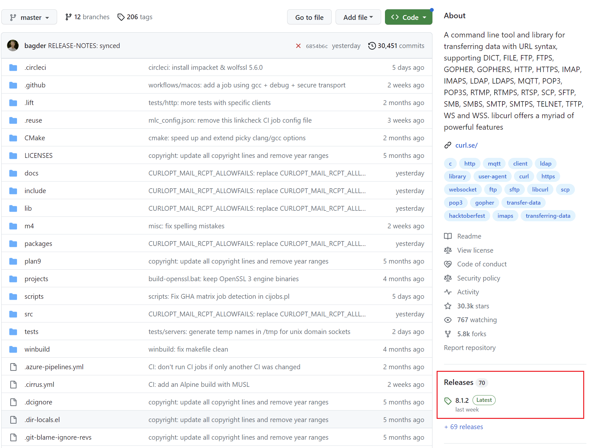
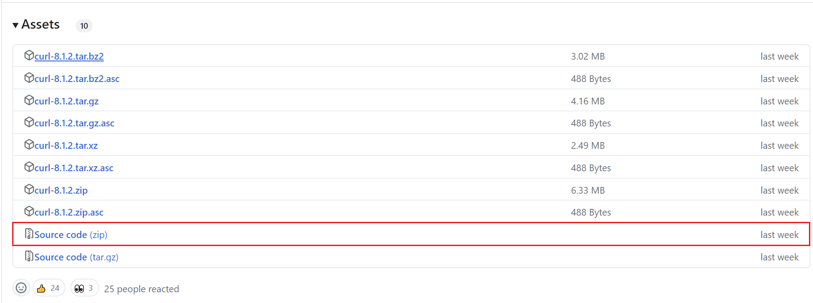
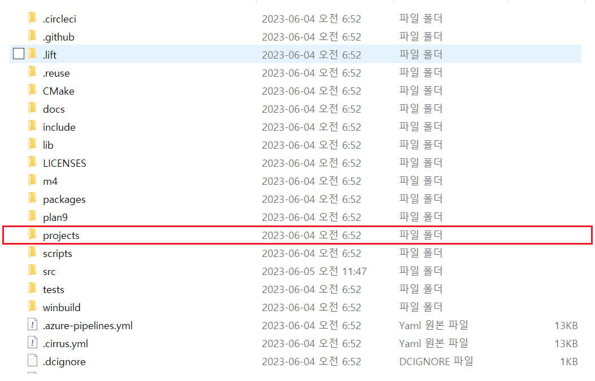
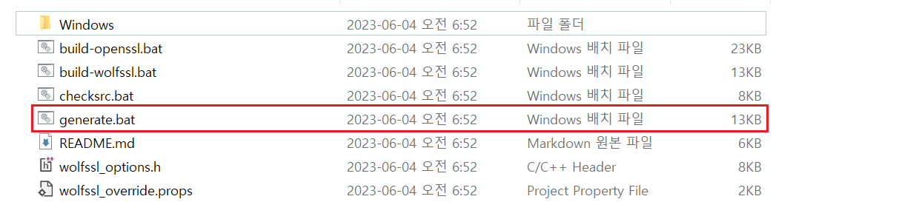
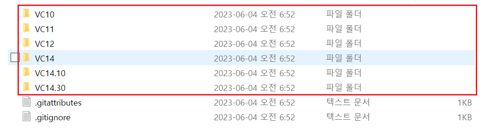
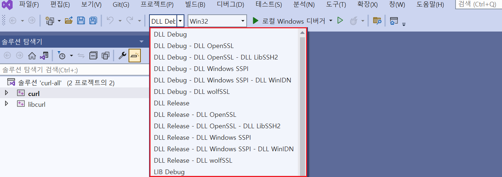
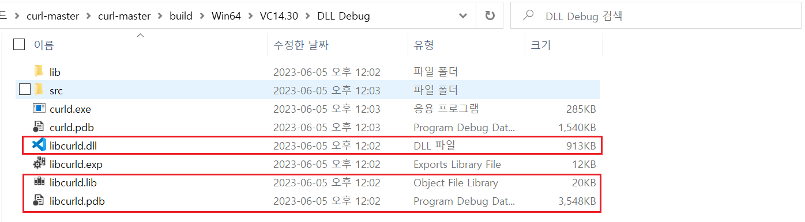
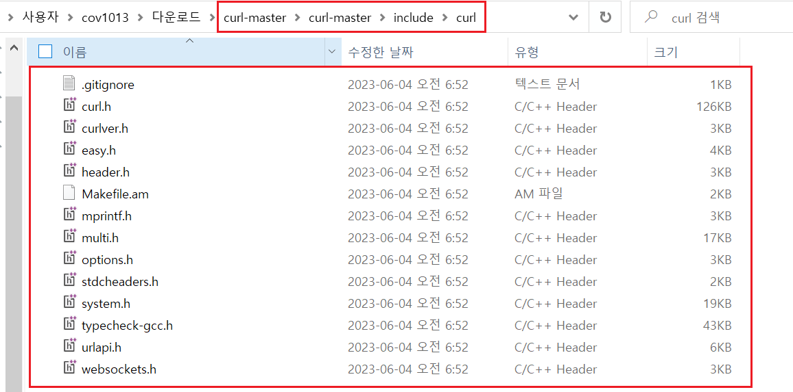

# `libcurl` 사용법

예제 코드 : `../ExampleCodes/libcurlExample`

## 라이브러리 설치하기

1. [GitHub](https://github.com/curl/curl)에서 가장 최신 버전의 **Release** 페이지로 이동



2. 소스 코드 압축 파일 다운로드



3. 압축 해제 후 폴더 내부의 `projects` 폴더로 이동



4. `generate.bat`를 실행하여 빌드에 필요한 소스 코드를 생성한다. (*소스 코드가 정상 생성됐다면 `generate.bat`이 자동 종료된다.*)



5. `projects/Windows` 폴더로 이동하여 아래 표를 참고하여 자신의 [`Visual Studio` 버전](https://github.com/curl/curl/tree/master/projects#building-with-visual-c)에 맞는 `.sln` 파일을 오픈한다.



6. 빌드 환경을 선택하고 빌드



7. 빌드 성공 후 `~/build` 폴더에서 라이브러리 파일을 자신의 프로젝트로 복사한다.



8. `~/include/curl` 폴더를 자신의 프로젝트에 복사한다. (*헤더 파일을 제외한 나머지 파일은 삭제해도 된다.*)



9. 자신의 프로젝트에서 `libcurl` 라이브러리의 헤더 파일과 라이브러리 파일을 import한다.

- 예제 솔루션 파일의 프로젝트 설정 부분 참고.


<br>


## 라이브러리 설명

TODO : 

<br>


## 예제코드

```cpp
#include <curl.h>
#include <string>
#include <iostream>
#include <cstring>

using namespace std;

size_t callBackFunk(char* ptr, size_t size, size_t nmemb, string* stream)
{
	int realsize = size * nmemb;
	stream->append(ptr, realsize);

	return realsize;
}

void main()
{
	CURL* curl;
	CURLcode res;

	std::string strTargetURL = "http://127.0.0.1:11502/AuthCheck";
	std::string strResourceJSON = "{\"AuthID\": \"TEST1\", \"AuthToken\":\"Test\"}";

	curl_slist* headerlist = NULL;
	headerlist = curl_slist_append(headerlist, "Content-Type: application/json");

	curl_global_init(CURL_GLOBAL_ALL);

	curl = curl_easy_init();
	string chunk;

	if (curl)
	{
		curl_easy_setopt(curl, CURLOPT_URL, strTargetURL.c_str());
		curl_easy_setopt(curl, CURLOPT_HTTPHEADER, headerlist);
		curl_easy_setopt(curl, CURLOPT_SSL_VERIFYPEER, false);
		curl_easy_setopt(curl, CURLOPT_SSL_VERIFYHOST, false);
		curl_easy_setopt(curl, CURLOPT_POST, 1L);
		curl_easy_setopt(curl, CURLOPT_POSTFIELDS, strResourceJSON.c_str());
		curl_easy_setopt(curl, CURLOPT_POSTFIELDSIZE, strResourceJSON.length());
		curl_easy_setopt(curl, CURLOPT_WRITEFUNCTION, callBackFunk);
		curl_easy_setopt(curl, CURLOPT_WRITEDATA, (void*)&chunk);

		res = curl_easy_perform(curl);

		curl_easy_cleanup(curl);
		curl_slist_free_all(headerlist);

		if (res != CURLE_OK)
		{
			fprintf(stderr, "curl_easy_perform() failed: %s\n", curl_easy_strerror(res));
		}

		std::cout << "------------Result" << std::endl;
		std::cout << chunk << std::endl;
	}
}
```