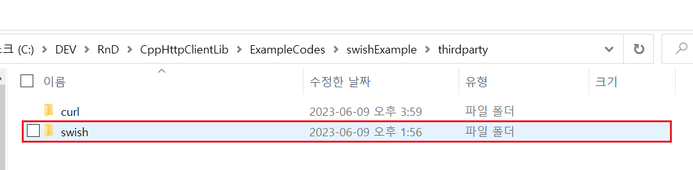

# `swish` 사용법

예제 코드 : `~/ExampleCodes/swishExample`

## 들어가기전에

해당 문서에서 설명할 `swish` 라이브러리는 [libcurl](https://github.com/curl/curl)을 `C++`로 랩핑한 라이브러리다.

따라서 `swish` 라이브러리를 사용하기 위해서는 프로젝트에 `libcurl` 라이브러리가 설치되어 있어야한다. 

(*`libcurl` 라이브러리 설치 방법은 다음 [문서](~/Manuals/libcurl.md)를 참고한다.*)

## 라이브러리 설치하기

- (*참고사항*) 예제에서는 프로젝트 내부에 `thirdparty`라는 별도의 폴더를 생성하여 다음과 같이 라이브러리 파일들을 관리하고 있다.

1. [GitHub](https://github.com/lamarrr/swish)에서 프로젝트를 다운로드한다.

2. 다운로드 한 프로젝트 폴더 내부에서 `swish` 폴더를 자신의 프로젝트로 옮긴다.

3. 소스코드 Include

## 라이브러리 설명

## 라이브러리 사용하기
